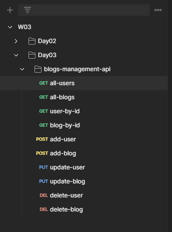

# Challenge : Blogs Management API
Introducing Axios "promise-based" HTTP Client and the fake JSON server.

## What is Axios?

Axios is a _[promise-based](https://javascript.info/promise-basics)_ HTTP Client for [`node.js`](https://nodejs.org/) and the browser. It is _[isomorphic](https://www.lullabot.com/articles/what-is-an-isomorphic-application)_ (= it can run in the browser and nodejs with the same codebase). On the server-side it uses the native node.js `http` module, while on the client (browser) it uses XMLHttpRequests.

## Features

-   Make [XMLHttpRequests](https://developer.mozilla.org/en-US/docs/Web/API/XMLHttpRequest) from the browser
-   Make [http](http://nodejs.org/api/http.html) requests from node.js
-   Supports the [Promise](https://developer.mozilla.org/en-US/docs/Web/JavaScript/Reference/Global_Objects/Promise) API
-   Intercept request and response
-   Transform request and response data
-   Cancel requests
-   Timeouts
-   Query parameters serialization with support for nested entries
-   Automatic request body serialization to:
    -   JSON (`application/json`)
    -   Multipart / FormData (`multipart/form-data`)
    -   URL encoded form (`application/x-www-form-urlencoded`)
-   Posting HTML forms as JSON
-   Automatic JSON data handling in response
-   Progress capturing for browsers and node.js with extra info (speed rate, remaining time)
-   Setting bandwidth limits for node.js
-   Compatible with spec-compliant FormData and Blob (including `node.js`)
-   Client side support for protecting against [XSRF](http://en.wikipedia.org/wiki/Cross-site_request_forgery)

## Folder Structure
    blogs-management-api/
    ├── api/
    │   ├── blogsAPI.js
    │   └── usersAPI.js
    ├── controllers/
    │   ├── blogsCRUD.js
    │   └── usersCRUD.js
    ├── middlewares/
    │   └── authenticator.js (+logger)
    ├── models/
    │   └── database.json
    ├── routes/
    │   ├── blogsRoutes.js
    │   └── usersRoutes.js
    ├── server.js
    └── package.json

## JSON Server
Run json-server on port : 5000 by using,
```bash
$ npm run fakeapi
```

## Postman


Haven't figured out how to integrate Github with Postman.. but will soon.

## Authentication
By comparing the `blogs.author` (a unique username) to the client's username `req.headers.username`.

## On JSON-Server Id incrementations 
the latest version default beahviour is by asigning random hex user ids. For normal increments, roll back to an older release. 

For more details, [Github Issue](https://github.com/typicode/json-server/issues/552).


shyl.
