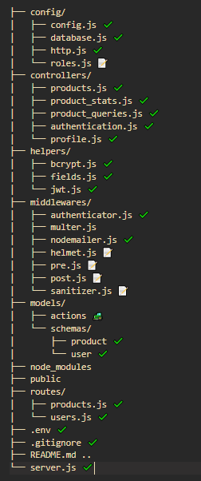

# Project Description: Express.js eCommerce Platform
## Overview
This project aims to build an eCommerce platform using Express.js and MongoDB with Mongoose ORM. The platform allows users to browse, search, filter, and sort products. Users can register, authenticate, manage their profiles, and perform CRUD operations on products they own.
## Setup
1. Install dependencies using `npm install`.
2. Set up environment variables (e.g., database connection string, JWT secret, email service credentials).
3. Run the application using `npm start`.
## Technologies Used
- Express.js
- Mongoose (MongoDB)
- Multer (for handling file uploads)
- JSON Web Token (JWT) for authentication
- Bcrypt (for hashing passwords)
- Express Rate Limit (for rate limiting)
- Helmet (for securing HTTP headers)
- Compression (for compressing responses)
- express-validator (For advanced request validation)
- xss (For preventing cross-site scripting (XSS) attacks by sanitizing user input)
- dotenv (define your environment variables)
- emailjs || nodemailer (sending mail)
**NOTES**: validation, compression, hashing and more can be achieved using mongoose-plugins. v2?
## Folder Structure
This section outlines the folder structure of the project, providing a clear overview of how the project is organized.
ecommer-platform/

;

## User Endpoints
### Authentication
- `POST /api/auth/register`: Register a new user. Upon successful registration, an email confirmation is sent.
- `POST /api/auth/login`: Login existing user. Returns JWT token.
### User Profile
- `GET /api/profile`: Get current user's profile information.
- `PUT /api/profile`: Update current user's profile.
- `DELETE /api/profile`: Delete current user's profile.
## Product Endpoints
### Products
- `GET /api/products`: Get all products.
- `GET /api/products/:id`: Get a specific product by ID.
- `POST /api/products`: Create a new product.
- `PUT /api/products/:id`: Update a product.
- `DELETE /api/products/:id`: Delete a product.
### Filtering and Sorting
- `GET /api/products?category=:category`: Filter products by category.
- `GET /api/products?sortBy=:field&order=:order`: Sort products by a field in ascending or descending order.
- `GET /api/products?search=:keyword`: Search products by keyword.
- `GET /api/products?minPrice=:minPrice&maxPrice=:maxPrice`: Filter products by price range. Specify the minimum and maximum price to retrieve products within that range.
- `GET /api/products?page=:page&limit=:limit`: Get paginated results using MongoDB methods `skip` and `limit`.
### Advanced Features: Aggregation and Mongoose Middlewares
- `GET /api/products/stats`: Use MongoDB aggregation to retrieve statistics about products, such as total count, average price, or most popular categories.
### Additional Tasks:
- Implement a **pre-save** middleware for the User model to hash the password before saving it to the database.
- Add a **post-save** middleware for the User model to send a welcome email to newly registered users.
## User Entity
The user entity represents a registered user in the system.
- `username`: The unique username chosen by the user for identification.
- `email`: The unique email address of the user, used for authentication and communication.
- `password`: The hashed password chosen by the user for authentication.
- `age`: The age of the user.
- `Country`: The address of the user.
- `sex`: The gender of the user, which can be either "male" or "female".
- `phoneNumber`: The phone number of the user.
- `lastLogin`: The timestamp indicating the user's last login.
- Other optional profile fields: Additional information about the user such as bio, interests, etc.(optional)
- `createdAt`: The timestamp indicating when the user account was created.
## Product Entity
The product entity represents an item available for sale on the eCommerce platform.
- `title`: The title or name of the product.
- `description`: A brief description of the product.
- `price`: The price of the product.
- `category`: The category to which the product belongs.
- `images`: An array containing URLs of product images (maximum 4 images).
- `owner`: The user ID of the owner/seller of the product.
- `stock`: The number of items available in stock.
- `published`: A boolean value indicating whether the product is published (true) or not (false). If set to false, the product will not be visible on the platform.
- `createdAt`: The timestamp indicating when the product was added to the platform.
# Instructions
## Authentication and Authorization
- Implement JWT-based authentication for user registration and login.
- Ensure that only authenticated users can perform certain actions (e.g., editing their profile, adding products).
## Input Validation and Sanitization
- Utilize express-validator middleware to validate and sanitize incoming request data.
- Validate user input for registration, login, and profile updates to prevent malformed data and security vulnerabilities.
## Error Handling
- Implement error handling middleware to catch and handle errors gracefully.
- Provide informative error messages to clients for better debugging and user experience.
## Middleware
- Implement middleware functions for tasks such as authentication, request validation, and error handling.
- Ensure that middleware functions are properly organized and applied to relevant routes.
## File Uploads
- Use Multer middleware for handling file uploads, especially for product images.
- Ensure that uploaded files are properly processed, stored, and associated with the corresponding products.
## Database Operations
- Use Mongoose ORM to interact with the MongoDB database.
- Implement CRUD operations for users and products, ensuring data integrity and consistency.
## Email Confirmation
- Implement email confirmation functionality for user registration using Nodemailer or EmailJS.
- Ensure that users receive a confirmation email upon successful registration with a link to activate their accounts.
## Security Practices
- Implement security best practices such as password hashing using bcrypt to protect user passwords.
- Utilize helmet middleware to set secure HTTP headers and prevent common web vulnerabilities.
## Rate Limiting
- Implement rate-limiting middleware using express-rate-limit to protect against abusive API requests and potential DoS attacks.
## [Postman Testing](https://kerberos-arkx.postman.co/workspace/fashyl's-api-testing~84fc7911-2cb5-490c-8db4-02a5a9713f7f/folder/32845137-eb6e4c02-8ef2-420f-a086-a9860d8edcce?action=share&creator=32845137&ctx=documentation)
To ensure the functionality and reliability of the backend, candidates are required to structure their Postman setup effectively. Below are the key components that candidates should include in their Postman testing:
1. **Environment Variables**: Utilize environment variables to store sensitive information such as API keys, tokens, and base URLs. This allows for easy management and switching between different environments (e.g., development, production).
2. **Collections**: Organize API requests into collections based on functionality or feature sets. Each collection should contain related requests and tests for specific endpoints or scenarios.
3. **Request Structure**: Ensure that each request is properly structured with appropriate HTTP methods, headers, query parameters, request body (if applicable), and URL paths. Use descriptive names and comments to provide clarity and context.
7. **Documentation**: Document the purpose and usage of each request and test within the collection. Include descriptions, example payloads, and any additional information necessary for understanding and maintaining the tests.
8. **Folder Structure**: Organize collections and requests into folders to maintain a logical and hierarchical structure. This helps in managing large collections and makes it easier to navigate and locate specific requests.
By structuring their Postman setup effectively and following best practices, candidates can thoroughly test the backend API and ensure its functionality, reliability, and adherence to specifications.